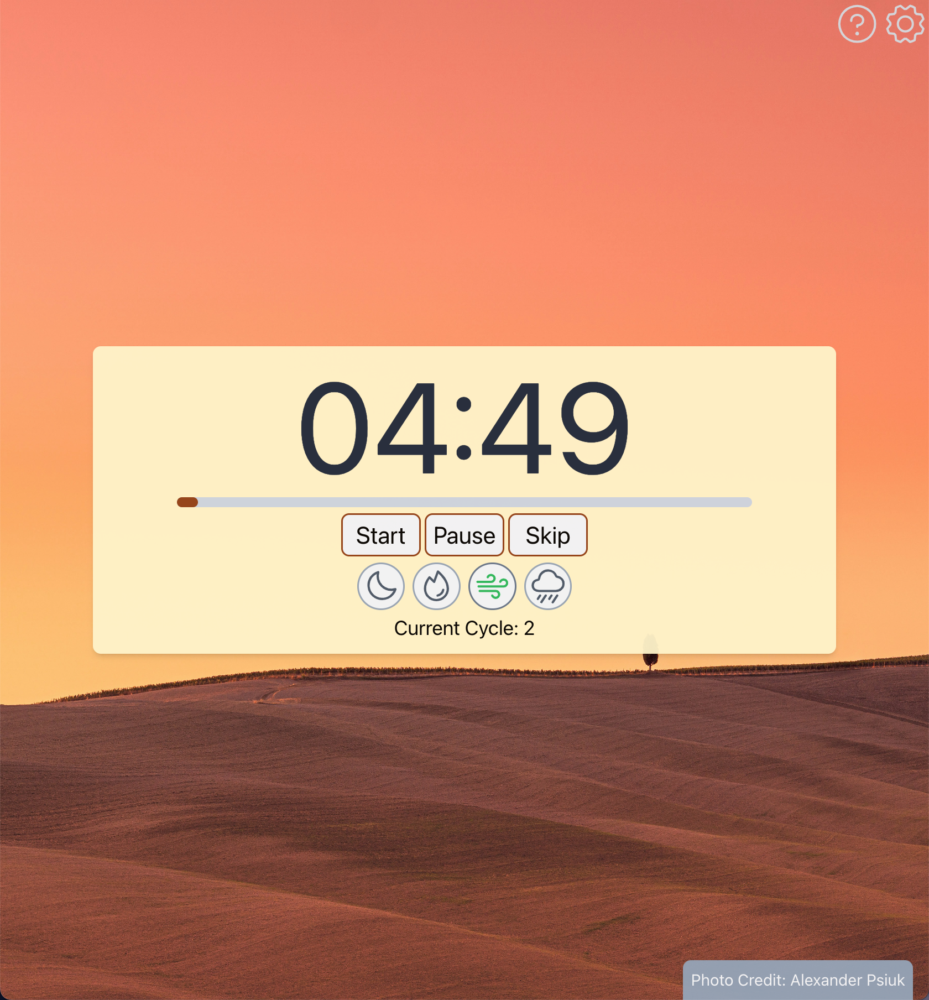
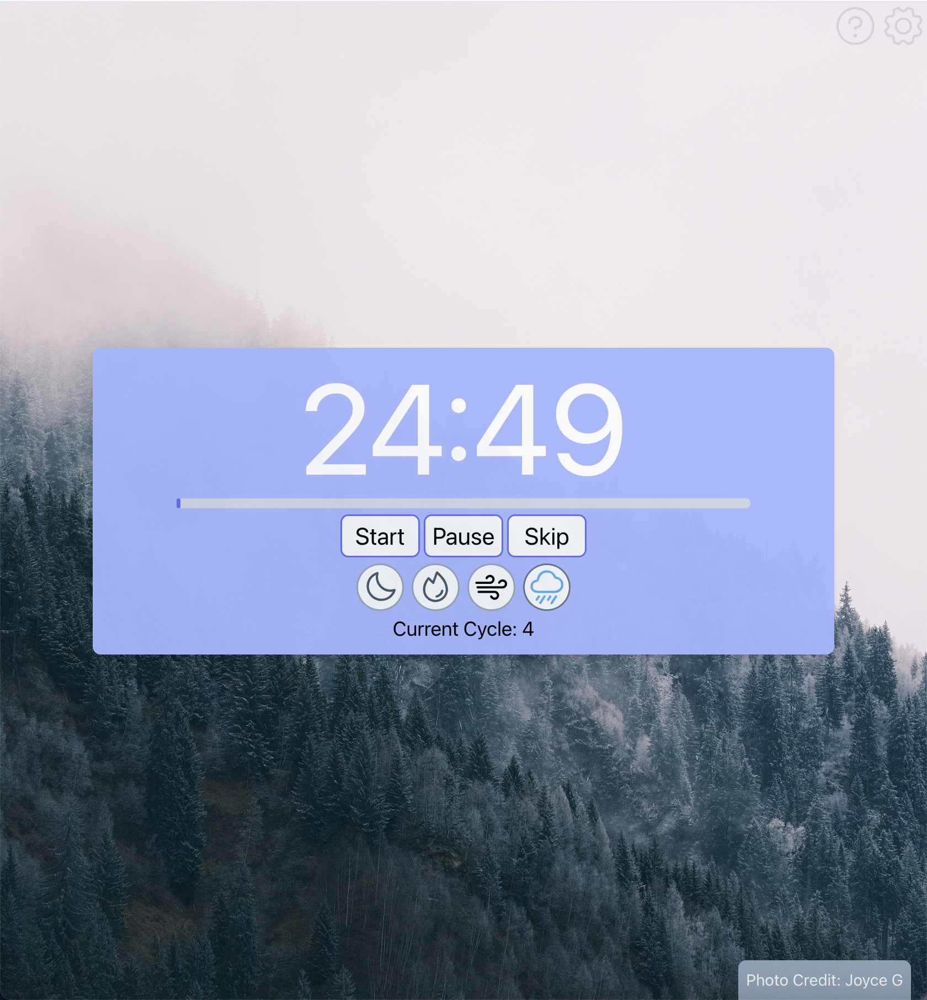

# CozyStudy App

### CozyStudy Preview

  
  
  

---

### What does CozyStudy offers

CozyStudy is an elevated pomordoro timer that offers users a customized experience for productivity.

Like the typical pomodoro study technique, this app offers additional settings for the length of study and rest, color themes, and backgrounds.

Campfire, Wind, and Rain ambient noises such as are available as well.

---

### Tech Stack is used

CozyStudy uses a React Frontend Framework with TailwindCSS styling.

---

### Where to find CozyStudy

https://www.cozystudy.xyz/
https://cozystudy.vercel.app/

---

### Further improvements

Mobile app planned...
